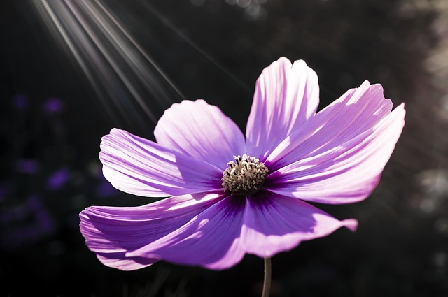

### Introduction (Background)

Plants in the space are the plants grown in the outer space.
They can be used for refreshing the atmosphere for extraterrestrial colonies or
as a renewable source of food.

One of the wonders of the Earth's nature is flowers.
They are not only reproductive structures for many plants but also very beautiful blooms.
Also, flowers in the space may provide a psychological benefit to human spaceflight crews.

### Problem

Growing process looks pretty simple on the Earth.
In the outer space, you have problems with how plants grow without gravity, temperature, soils and different types of lighting.
Thus as you can see it's a more complex task for flowers.
So what's the best way to grow and store flowers in the space?

### Output

Describe how you see the process of growing, saving and/or delivering flowers in the outer space.
Use any form for your solution: writing, videos, images or schemes.

### Useful Resources

[Plants in Space](https://en.wikipedia.org/wiki/Plants_in_space)

[Growing Salads for Long-Term Human Space Travel](http://www.nasa.gov/centers/kennedy/news/releases/2004/p03-04.html)

[Successful Space Seed-to-Seed Plant Growth Experiment](http://www.space.bas.bg/astro/aerosp16/tania1.pdf)

### Metadata
Theme: Biology

Skills: Biology, Physics

Difficulty: ★★★☆☆
