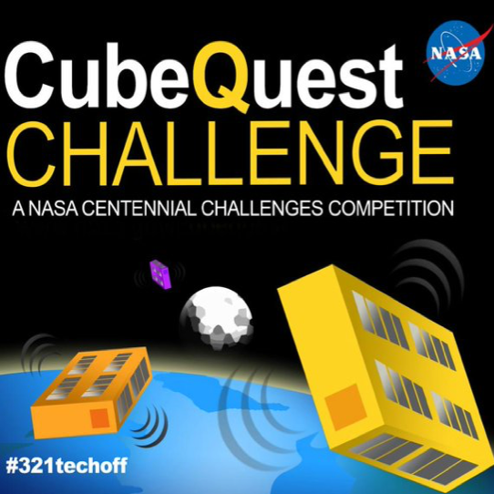

### Introduction

The Cube Quest competition, sponsored by NASA’s Space Technology Mission Directorate Centennial Challenge Program, offers a total of $5.5 million to teams that meet the challenge objectives of designing, building and delivering flight-qualified, small satellites capable of advanced operations near and beyond the moon.

Cube Quest teams will have the opportunity to compete for a secondary payload spot on the first mission of NASA’s Orion spacecraft, which will launch atop the agency’s Space Launch System (SLS) rocket.

### Problem

The competition includes three stages: Ground Tournaments, Deep Space Derby, and Lunar Derby. All teams may compete in any one of the four Ground Tournaments. Teams that rate high on mission safety and probability of success will receive incremental awards. The Ground Tournaments will be held every four to six months, leading to an opportunity to earn a spot on the first integrated flight of Orion and SLS.

The Deep Space Derby will focus on finding innovative solutions to deep space communications using small spacecraft, and the Lunar Derby will focus primarily on propulsion for small spacecraft and near-Earth communications. Together, these challenges are expected to contribute to opening deep space exploration to non-government spacecraft for the first time.

Advancements in small spacecraft capabilities may not only provide benefits to future missions, but also may enable entirely new mission scenarios. The Cube Quest Challenge seeks to establish precedence for all subsystems necessary to perform deep-space exploration using small spacecraft.

**[How to Enter](http://www.nasa.gov/cubequest/howtoenter)**

### Output

Describe you experience and results if you (your team) take participation in this NASA challenge. Or share ideas for participators, maybe, it will allow you to find a team and enter to the challenge.

### Additional material

[Information and Updates](http://www.nasa.gov/cubequest/details)

[the Rules document](http://www.nasa.gov/sites/default/files/ccp_cq_opsrul_001a.pdf)

## Credits

[NASA site](http://www.nasa.gov/directorates/spacetech/centennial_challenges/cubequest/index.html)
