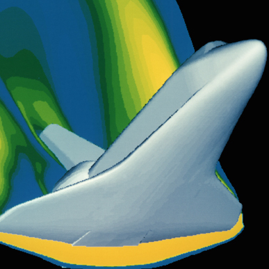

# Introduction

Computational fluid dynamics, usually abbreviated as CFD, is a branch of fluid mechanics that uses numerical analysis and algorithms to solve and analyze problems that involve fluid flows. Computers are used to perform the calculations required to simulate the interaction of liquids and gases with surfaces defined by boundary conditions. With high-speed supercomputers, better solutions can be achieved. Ongoing research yields software that improves the accuracy and speed of complex simulation scenarios such as transonic or turbulent flows. Initial experimental validation of such software is performed using a wind tunnel with the final validation coming in full-scale testing, e.g. flight tests.

# Problem

The number of aerospace launches is increasing and computer simulations help to decrease the time for testing and preparation of space shuttles. CFD simulations allow to test a spacecraft in various weather conditions, that can help to increase the number of launches.

Make a CFD model for spacecraft launching process. You can use any rocket or shuttle model that was launched already. Try to experiment with various weather conditions and find which weather is good enough for aerospace launches.

# Output

Describe the process of simulation and write conclusions of the experiment. Any video and images will help to understand the process.

# Useful Resources

[CFD Online](http://www.cfd-online.com/Wiki/Main_Page)

[The Java Virtual Wind Tunnel](http://raphael.mit.edu/Java/)

["Atmospheric and Space Flight Dynamics" Book](https://books.google.ru/books?id=2IFj1UBaEqsC&dq=aerospace+launch+simulation+example&source=gbs_navlinks_s)

## Credits

[wikipedia](https://en.wikipedia.org/wiki/Computational_fluid_dynamics)
