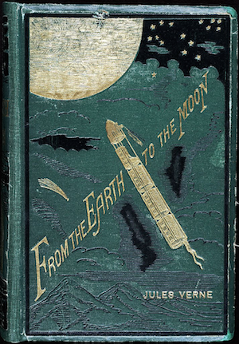

### Introduction (Background)

For me, the passion to outer space and high tech began neither from the lessons of astronomy at school
nor from my college. The first interest to cosmos appeared from books - sci-fi books.
I read them a lot. And after reading several of them,
I started to learn mathematics, engineering, and other sciences because I would have loved to be closer
to all things that I saw in those books.

Popularization of the space theme is an important task and
your writing skills can be no less important than engineering or physics expertise.

### Problem

Colonization of the Moon has excited spacers for a long time.
Let's dream about it but in a sci-fi style.

Write a short story about a moon colony (or colonies).
It's preferable if the story will be a science fiction but, if you want, you can write in other genres.

### Output

A short story. Add illustrations if you want.

### Useful Resources

[Science Fiction](https://en.wikipedia.org/wiki/Science_fiction)

[How to write a short story](http://www.wikihow.com/Write-a-Short-Story)

[20 Writing Tips from Fiction Authors](http://www.iuniverse.com/expertadvice/20writingtipsfrom12fictionauthors.aspx)

### Metadata
Theme: Literacy

Skills: Writing, Creativity

Difficulty: ★★☆☆☆
